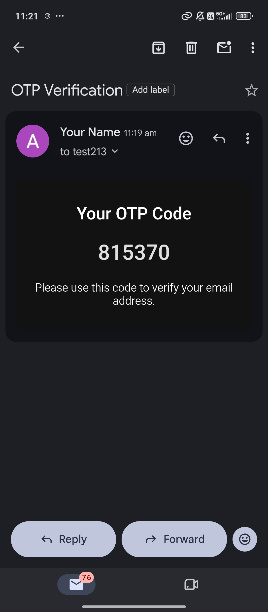

# yt-auth — JWT Authentication System

A complete authentication backend built with Node.js, Express, and MongoDB. Supports user registration, login, protected routes, refresh token rotation, and email OTP verification.

## Features

- **Register & Login** — secure password hashing
- **JWT-based authentication** — short-lived access tokens + long-lived refresh tokens
- **Refresh Token Rotation** — refresh tokens are stored per-user and rotated on every use
- **Protected Routes** — middleware-free route protection using Bearer tokens (`/api/auth/get-me`)
- **Email OTP Verification** — OTP sent to the user's email for account verification
- **Centralized Error Handling** — consistent JSON error responses across all routes

## Tech Stack

- **Runtime:** Node.js
- **Framework:** Express.js
- **Database:** MongoDB with Mongoose
- **Authentication:** JSON Web Tokens (JWT)
- **Email Service:** Nodemailer (for OTP delivery)

## Project Structure

```
Authentication/
├── src/
│   ├── config/
│   │   ├── config.js
│   │   └── database.js
│   ├── controllers/
│   │   └── auth.controller.js
│   ├── models/
│   │   └── user.model.js
│   ├── routes/
│   │   └── auth.routes.js
│   └── app.js
├── .env.example
├── package.json
└── server.js
```

## Getting Started

### Prerequisites

- Node.js (v18 or higher)
- MongoDB (local instance or MongoDB Atlas)
- An email account for sending OTPs (e.g., Gmail with an App Password)

### Installation

1. Clone the repository:
   ```bash
   git clone https://github.com/ruchisharmaku-debug/yt-auth.git
   cd yt-auth
   ```

2. Install dependencies:
   ```bash
   npm install
   ```

3. Create a `.env` file in the root directory (see `.env.example` below).

4. Start the development server:
   ```bash
   npm run dev
   ```

The server will run on `http://localhost:3000` by default.

## Environment Variables

Create a `.env` file with the following variables:

```
PORT=3000
MONGO_URI=your_mongodb_connection_string
ACCESS_TOKEN_SECRET=your_access_token_secret
REFRESH_TOKEN_SECRET=your_refresh_token_secret
EMAIL_USER=your_email@gmail.com
EMAIL_PASS=your_email_app_password
```

Generate strong secrets using:
```bash
node -e "console.log(require('crypto').randomBytes(64).toString('hex'))"
```

## API Endpoints

| Method | Endpoint                     | Description                          | Auth Required |
|--------|-------------------------------|---------------------------------------|----------------|
| POST   | `/api/auth/register`          | Register a new user                   | No             |
| POST   | `/api/auth/login`             | Log in an existing user               | No             |
| GET    | `/api/auth/get-me`            | Get the logged-in user's profile      | Yes (Bearer)   |
| POST   | `/api/auth/refresh-token`     | Get a new access token                | No             |
| POST   | `/api/auth/verify-otp`        | Verify email using OTP                | No             |

### Example: Register

**Request**
```json
POST /api/auth/register
{
  "username": "ruchi_sharma",
  "email": "ruchi@example.com",
  "password": "your_password"
}
```

**Response**
```json
{
  "message": "User registered successfully",
  "user": {
    "id": "...",
    "username": "ruchi_sharma",
    "email": "ruchi@example.com"
  },
  "token": "...",
  "refreshToken": "..."
}
```

### Example: Get Profile (Protected Route)

**Request**
```
GET /api/auth/get-me
Authorization: Bearer <accessToken>
```

**Response**
```json
{
  "message": "User fetched successfully",
  "user": {
    "id": "...",
    "username": "ruchi_sharma",
    "email": "ruchi@example.com"
  }
}
```

## Screenshots

### OTP Email Verification
The user receives a 6-digit OTP code via email to verify their account.



## Security Notes

- Passwords are never stored in plain text.
- Access tokens are short-lived (15 minutes) to limit exposure if leaked.
- Refresh tokens are rotated on every use and invalidated after logout.
- Never commit your `.env` file to version control — it is already excluded via `.gitignore`.

## Author

**Ruchi Sharma**
GitHub: [@ruchisharmaku-debug](https://github.com/ruchisharmaku-debug)
